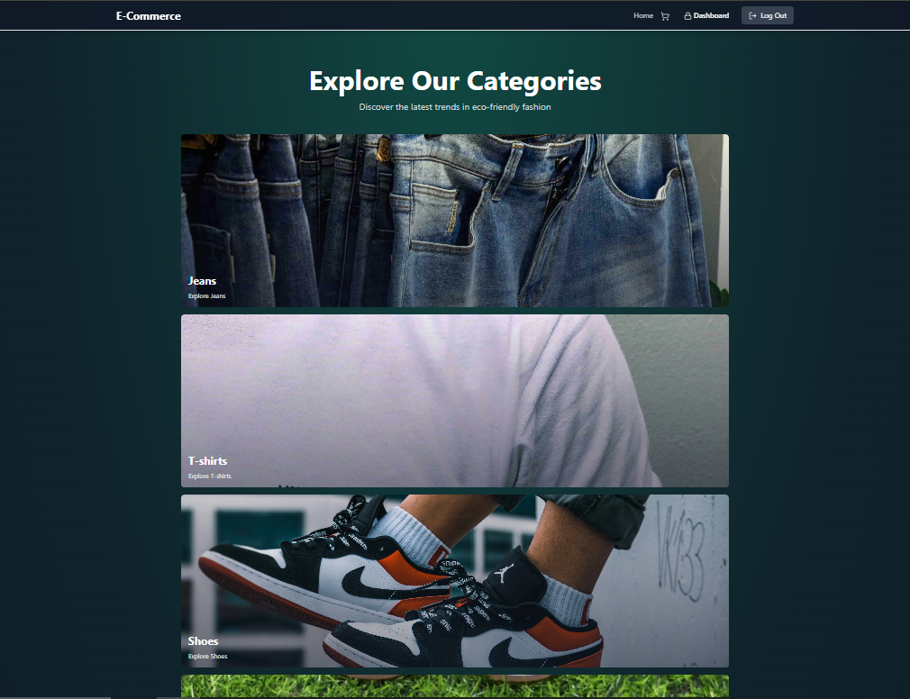
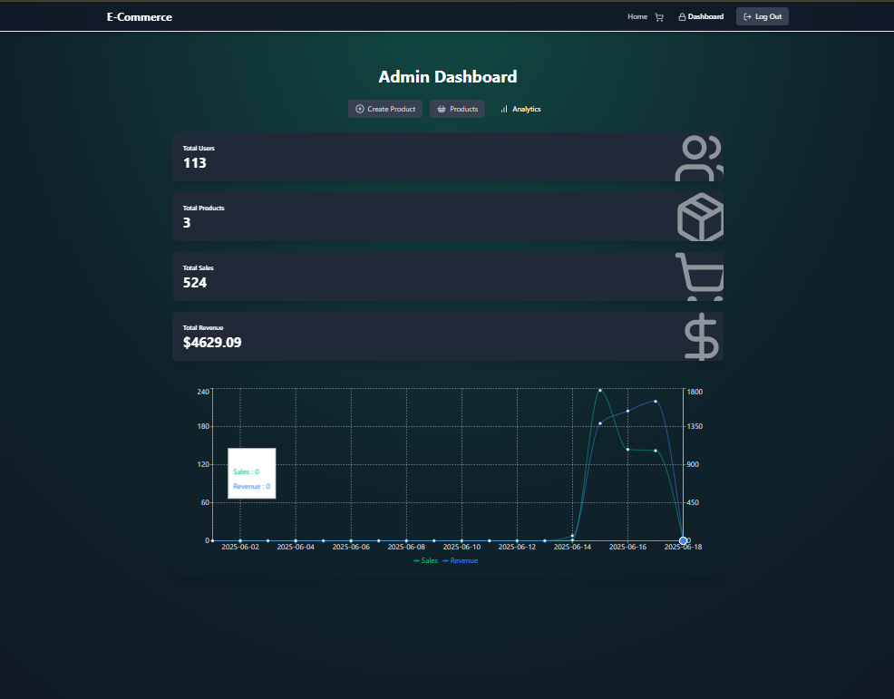
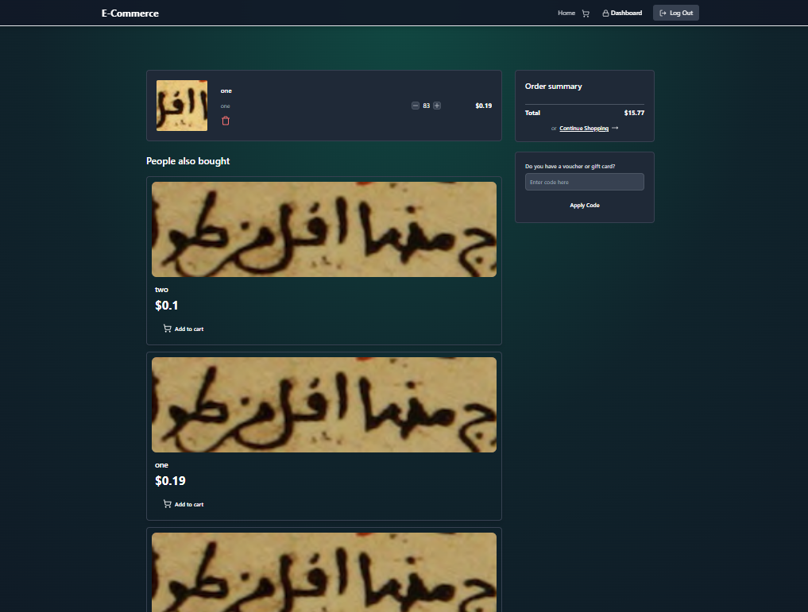
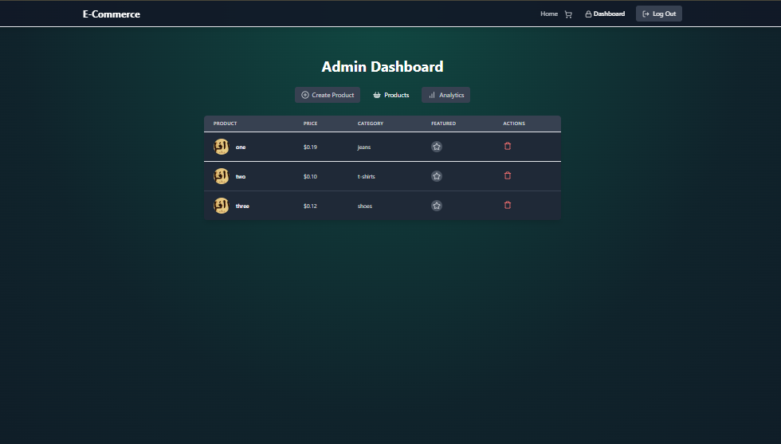

# 🛍️ Online Product Purchase Platform

A full-stack e-commerce platform built with **React** and **Node.js (Express)**. It allows **Admins** to manage products and **Users** to browse and purchase them. Real-time analytics and order management are also supported. *(Payment integration coming soon!)*

---

## 🚀 Features

### ✅ Admin Panel
- Add new products with title, description, price, image, and category
- View and manage all products
- View sales and revenue analytics
- Protected admin routes (JWT-based auth)

### 👤 User Panel
- Browse all available products
- View product details
- Add items to cart *(optional if cart system is implemented)*
- Purchase products *(payment integration pending)*

### 📊 Analytics
- View real-time data (e.g. users, sales, revenue)
- Daily sales chart (Recharts)
- Admin dashboard overview

---

## 🛠️ Tech Stack

### 📦 Backend
- Node.js + Express.js
- MongoDB + Mongoose
- JWT for authentication
- bcryptjs, dotenv, cookie-parser
- CORS, helmet, morgan

### 🎨 Frontend
- React.js + React Router DOM
- Tailwind CSS for styling
- Recharts for data visualization
- Framer Motion for animations
- Socket.IO Client *(optional for future real-time updates)*

---

## ⚙️ Getting Started

### 1. Clone the Repository

```bash
git clone https://github.com/your-username/E-CommerceStore.git
cd E-CommerceStore
```

### 2. Install Dependencies

#### 🔧 Backend

```bash
cd backend
npm install
```

#### 💻 Frontend

```bash
cd ../frontend
npm install
```

---

### 3. Setup Environment Variables

Create a `.env` file inside the `backend/` directory:

```ini
PORT=7000
MONGO_URI=your_mongodb_connection_string
JWT_SECRET=your_super_secret_key
CLIENT_URL=http://localhost:5173
```

> ⚠️ Replace the placeholders with your actual credentials.

---

### 4. Run the App

#### 📦 Backend

```bash
cd backend
npm run dev
```

#### 💻 Frontend

```bash
cd ../frontend
npm run dev
```

> The app will be live at:  
> **Frontend** ➝ http://localhost:5173  
> **Backend** ➝ http://localhost:7000

---
## 📁 Project Structure

```
E-CommerceStore/
│
├── backend/                         # Express + MongoDB backend
│   ├── controllers/                 # Controller logic
│   │   ├── analytics.controller.js
│   │   ├── auth.controller.js
│   │   ├── cart.controller.js
│   │   ├── coupon.controller.js
│   │   ├── payment.controller.js
│   │   └── product.controller.js
│   │
│   ├── lib/                         # Helper functions / configs
│   │
│   ├── middleware/                  # Middleware (auth, error handling, etc.)
│   │
│   ├── models/                      # Mongoose models
│   │   ├── coupon.model.js
│   │   ├── order.model.js
│   │   ├── product.model.js
│   │   └── user.model.js
│   │
│   ├── routes/                      # API route definitions
│   │   ├── analytics.route.js
│   │   ├── auth.route.js
│   │   ├── cart.route.js
│   │   ├── coupon.route.js
│   │   ├── payment.route.js
│   │   └── product.route.js
│   │
│   └── server.js                    # Main server entry point
│
├── frontend/                        # React frontend
│   ├── public/
│   │   └── index.html               # Main HTML template
│   │
│   ├── src/                         # React source files
│   │   ├── components/              # Reusable UI components
│   │   │   ├── AnalyticsTab.jsx
│   │   │   ├── CartItem.jsx
│   │   │   ├── CategoryItem.jsx
│   │   │   ├── CreateProductForm.jsx
│   │   │   ├── FeaturedProducts.jsx
│   │   │   ├── GiftCouponCard.jsx
│   │   │   ├── LoadingSpinner.jsx
│   │   │   ├── Navbar.jsx
│   │   │   ├── OrderSummary.jsx
│   │   │   ├── PeopleAlsoBought.jsx
│   │   │   ├── ProductCard.jsx
│   │   │   └── ProductsList.jsx
│   │   │
│   │   ├── lib/                     # API helpers
│   │   │   
│   │   │
│   │   ├── pages/                   # Route pages
│   │   │   ├── AdminPage.jsx
│   │   │   ├── CartPage.jsx
│   │   │   ├── CategoryPage.jsx
│   │   │   ├── HomePage.jsx
│   │   │   ├── LoginPage.jsx
│   │   │   ├── PurchaseCancelPage.jsx
│   │   │   ├── PurchaseSuccessPage.jsx
│   │   │   └── SignUpPage.jsx
│   │   │
│   │   ├── stores/                  # Zustand stores (global state)
│   │   │   ├── useCartStore.js
│   │   │   ├── useProductStore.js
│   │   │   └── useUserStore.js
│   │   │
│   │   ├── App.jsx                  # Main app component
│   │   ├── main.jsx                 # React root entry
│   │   └── index.css                # Tailwind and global styles
│   │
│   └── README.md                    # Frontend-specific README (optional)
│
├── .gitignore
├── LICENSE
├── README.md                        # Root README
├── eslint.config.js
├── package.json
├── package-lock.json
├── postcss.config.js
├── tailwind.config.js
└── vite.config.js
```


---

## 🖼️ Website Preview






---

## 🧠 Future Improvements

- ✅ Real-time analytics dashboard
- ✅ Product analytics by date
- 🔜 Payment integration (Stripe / PayPal)
- 🔜 Order history
- 🔜 Cart system
- 🔜 Notifications system (via WebSockets)

---

## 🤝 Contributing

Pull requests are welcome! For major changes, please open an issue first to discuss what you would like to change.

---

